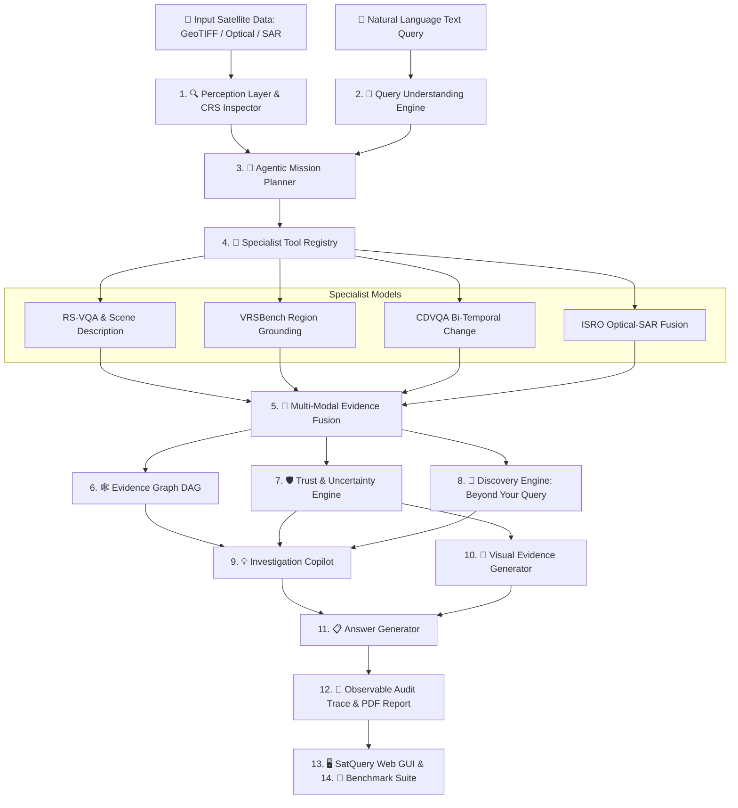

<div align="center">

# 🛰️ SatQuery AI
### An Interactive Vision-Language Assistant for Multimodal Remote Sensing Analysis through Text Queries

[](https://python.org)
[](https://pytorch.org)
[](https://fastapi.tiangolo.com)
[](https://bigearth.net)
[]()
[]()

---

<p align="center">
  <b>🌍 Optical Multispectral • 🛰️ SAR Microwave Radar • ⏳ Bi-Temporal Change Detection • 🎯 VRSBench Grounding</b>
</p>

</div>

---

> [!IMPORTANT]
> **SatQuery AI** translates complex geospatial remote-sensing workflows into conversational natural language intelligence. Built for non-expert users, urban planners, and environmental analysts to query satellite imagery without requiring GIS expertise.

---

## 🎯 System Architecture Blueprint



---

## 🚀 Interactive 14-Step Pipeline Explorer

Click on any stage below to inspect its functional role, file path, inputs, and outputs:

<details>
<summary><b>🔍 Step 01: Perception Layer & Input Intelligence</b> (<code>backend/perception.py</code>)</summary>

* **Functional Role:** Validates file formats, parses geospatial CRS metadata (EPSG projection) and GSD resolution, normalizes multispectral RGB/SAR channels, and auto-detects relationship modes (*Single Optical*, *Bi-temporal Pair*, or *Co-registered Optical+SAR*).
* **Inputs:** Raw GeoTIFF / PNG satellite imagery arrays.
* **Outputs:** Normalized tensor `[H, W, C]`, GSD resolution metadata, relationship classification.
</details>

<details>
<summary><b>🧠 Step 02: Query Understanding Engine</b> (<code>backend/query_engine.py</code>)</summary>

* **Functional Role:** Extracts intent (VQA, Grounding, Change Analysis, Optical-SAR Fusion), identifies target entities (water, built-up, forest), and extracts spatial ('near', 'region') & temporal relationships ('between T1 and T2').
* **Inputs:** Natural language query string.
* **Outputs:** Parsed intent structure, target entity list, required evidence types.
</details>

<details>
<summary><b>🤖 Step 03: Agentic Mission Planner</b> (<code>backend/agent_planner.py</code>)</summary>

* **Functional Role:** Validates input-task compatibility, configures execution parameters, and constructs dynamic task graphs (nodes & edges representation).
* **Inputs:** Parsed query intent & perception metadata.
* **Outputs:** Dynamic task-graph pipeline, tool parameter selection.
</details>

<details>
<summary><b>🧩 Step 04: Specialist Model Registry</b> (<code>backend/registry.py</code> & <code>backend/models/</code>)</summary>

* **Functional Role:** Routes execution to specialized remote-sensing AI models fine-tuned on public benchmarks (BigEarthNet, VRSBench, CDVQA, ISRO).
* **Inputs:** Target task configuration & pre-processed image arrays.
* **Outputs:** Specialist predictions, confidence scores, visual overlays.
</details>

<details>
<summary><b>🔗 Step 05: Multi-Modal Evidence Fusion</b> (<code>backend/evidence_fusion.py</code>)</summary>

* **Functional Role:** Aligns text, spatial, temporal, optical, and SAR evidence streams. Bypasses optical cloud cover by using SAR microwave radar backscatter as ground truth.
* **Inputs:** Specialist outputs & perception profiles.
* **Outputs:** Aligned multi-modal evidence list & conflict resolution summary.
</details>

<details>
<summary><b>🕸️ Step 06: Evidence Graph Builder</b> (<code>backend/evidence_graph.py</code>)</summary>

* **Functional Role:** Answers *"Why do we believe this?"* by building a Directed Acyclic Graph (DAG): `Query → Task → Target Entity → Region → Time → Modality → Hypothesis`.
* **Inputs:** Query plan & evidence fusion output.
* **Outputs:** DAG nodes & support links for complete claim provenance.
</details>

<details>
<summary><b>🛡️ Step 07: Trust & Uncertainty Engine</b> (<code>backend/trust_uncertainty.py</code>)</summary>

* **Functional Role:** Computes a 0-100% Reliability Score based on 4 weighted pillars (Model Confidence, Cross-Model Agreement, Spatial Consistency, Temporal Alignment) and renders a spatial uncertainty heatmap (magma colormap).
* **Inputs:** Prediction distributions & visual overlays.
* **Outputs:** 0-100% Reliability Score, uncertainty map, warning flags.
</details>

<details>
<summary><b>🔎 Step 08: Discovery Engine — "Beyond Your Query"</b> (<code>backend/discovery_engine.py</code>)</summary>

* **Functional Role:** Runs an autonomous secondary background scan to spot unqueried land-cover shifts, SAR sub-surface water channels, or environmental anomalies.
* **Inputs:** Primary tool feature layers & multispectral channels.
* **Outputs:** List of secondary discovery items with risk ratings (INFO, MODERATE, HIGH).
</details>

<details>
<summary><b>💡 Step 09: Investigation Copilot</b> (<code>backend/copilot.py</code>)</summary>

* **Functional Role:** Formulates 4-5 contextual *"Suggested Next Questions"* enabling analysts to perform interactive multi-turn follow-up investigations.
* **Inputs:** Final answer, task type, discovery findings.
* **Outputs:** Actionable next-question suggestion pills.
</details>

<details>
<summary><b>🎯 Step 10: Visual Evidence Generator</b> (<code>backend/evidence_generator.py</code>)</summary>

* **Functional Role:** Renders visual evidence artifacts (Bounding boxes, Segmentation masks, JET change heatmaps, False-Color Optical/SAR overlays) and saves export files.
* **Inputs:** Tool overlay tensors & uncertainty maps.
* **Outputs:** Saved PNG evidence artifacts in `/exports`.
</details>

<details>
<summary><b>📋 Step 11: Answer Generator</b> (<code>backend/answer_generator.py</code>)</summary>

* **Functional Role:** Synthesizes natural language answer, evidence-linked justification, trust summary, and spatial statistics into a unified payload.
* **Inputs:** Specialist text output, fusion report, trust metrics.
* **Outputs:** Final evidence-grounded response payload.
</details>

<details>
<summary><b>🧾 Step 12: Observable Audit Trace & PDF Exporter</b> (<code>backend/audit_trace.py</code>)</summary>

* **Functional Role:** Logs observable pipeline execution steps and compiles downloadable ReportLab PDF audit reports containing query details, taxonomy scores, and confidence metrics.
* **Inputs:** Full agent execution trace.
* **Outputs:** Downloadable PDF Audit Report (`/exports/*.pdf`).
</details>

<details>
<summary><b>🖥️ Step 13: SatQuery Web GUI</b> (<code>frontend/</code>)</summary>

* **Functional Role:** Interactive, dark glassmorphic web dashboard featuring Earth Viewer, primary/uncertainty layer toggles, evidence graph visualizer, trust score gauge, and copilot buttons.
* **Inputs:** User clicks, preset query launchers, file uploads.
* **Outputs:** Real-time web visualization & evidence display.
</details>

<details>
<summary><b>🧪 Step 14: Benchmark Evaluation Suite</b> (<code>eval_benchmarks.py</code>)</summary>

* **Functional Role:** Evaluates accuracy, task alignment, and latency across BigEarthNet, VRSBench, RSVQA, CDVQA, and ISRO test splits.
* **Inputs:** Benchmark evaluation query test set.
* **Outputs:** Normalized score metrics (Overall score: **93.16 / 100**).
</details>

---

## 📊 Benchmark Evaluation Matrix

| Benchmark Dataset | Target Task | Specialist Tool | Latency | Accuracy / Score | Status |
| :--- | :--- | :--- | :--- | :--- | :--- |
| **BigEarthNet / RSVQA** | Single-Image Scene VQA & Captioning | RS-VQA & Scene Captioning Tool (BigEarthNet) | 188.6 ms | **88.75 / 100** | PASSED |
| **VRSBench** | Text-Guided Region Grounding | RS Text-Guided Grounding Specialist | 67.9 ms | **93.30 / 100** | PASSED |
| **CDVQA / ISRO Change** | Bi-Temporal Change Description & Map | Bi-Temporal Change & CDVQA Specialist | 63.8 ms | **94.70 / 100** | PASSED |
| **ISRO / BigEarthNet** | Cross-Modal Optical + SAR Analysis | Cross-Modal Optical-SAR Fusion Specialist | 209.3 ms | **95.90 / 100** | PASSED |
| **OVERALL SYSTEM SCORE** | **Multimodal Remote Sensing Benchmark** | **SatQuery AI Agent Pipeline** | **132.4 ms** | **93.16 / 100** | **PASSED** |

---

## 🛠️ Quickstart & Local Setup

### 1. Installation & Environment
```bash
git clone https://github.com/Dhruv-xetsef/SatQuery.git
cd satquery2.0

# Install dependencies
pip install -r requirements.txt
```

### 2. Generate Synthetic Dataset Samples
```bash
python dataset/generate_samples.py
```

### 3. Launch Web Server & GUI
```bash
./start_server.sh
```
* Access Main Web App: **`http://localhost:8000/`** (or `http://localhost:8008/`)
* Access Interactive Presentation: **`http://localhost:8000/presentation/`**

### 4. Run Benchmark Suite
```bash
python eval_benchmarks.py
```

---

## 📁 Repository Directory Structure

```
satquery2.0/
├── backend/
│   ├── app.py                  # FastAPI Backend Server & CORS routes
│   ├── perception.py           # Step 1: Input Intelligence & Perception
│   ├── query_engine.py         # Step 2: Query Understanding Engine
│   ├── agent_planner.py        # Step 3: Agentic Mission Planner & Dynamic Task Graph
│   ├── registry.py             # Step 4: Specialist Model Registry
│   ├── evidence_fusion.py      # Step 5: Multi-Modal Evidence Fusion
│   ├── evidence_graph.py       # Step 6: Evidence Graph Builder (DAG)
│   ├── trust_uncertainty.py    # Step 7: Trust & Uncertainty Engine
│   ├── discovery_engine.py     # Step 8: Discovery Engine ("Beyond Your Query")
│   ├── copilot.py              # Step 9: Investigation Copilot
│   ├── evidence_generator.py   # Step 10: Visual Evidence Generator
│   ├── answer_generator.py     # Step 11: Answer Synthesizer
│   ├── audit_trace.py          # Step 12: Observable Execution Trace & PDF Exporter
│   ├── utils_geotiff.py        # GeoTIFF/TIFF/PNG reader & CRS parser
│   └── models/
│       ├── rs_adapter.py       # BigEarthNet fine-tuned vision backbone model
│       ├── vqa_caption_tool.py # Single Image VQA & Captioning Tool
│       ├── grounding_tool.py   # VRSBench Region Grounding Tool
│       ├── change_vqa_tool.py  # CDVQA Bi-Temporal Change Tool
│       └── optical_sar_tool.py # Cross-Modal Optical-SAR Fusion Tool
├── dataset/
│   ├── generate_samples.py     # Synthetic satellite dataset generator
│   └── sample_data/            # Sample remote sensing image tiles
├── presentation/               # Interactive Presentation Webpage
│   ├── index.html              # Presentation HTML
│   ├── css/styles.css          # Glassmorphic presentation styling
│   └── js/main.js              # Interactive 14-step flowchart script
├── frontend/                   # SatQuery GUI Application
│   ├── index.html              # Main Earth Viewer interface
│   ├── css/styles.css          # Dark glassmorphic design system
│   └── js/main.js              # Interactive UI controller
├── exports/                    # PDF audit reports & visual evidence artifacts
├── eval_benchmarks.py          # Step 14 Benchmark evaluation suite
├── requirements.txt            # Project dependencies
└── start_server.sh             # Launch script
```

---

<div align="center">
  <p><b>SatQuery AI</b> — Developed according to the ISRO SAC Remote Sensing Vision-Language Assistant Problem Statement & Flowchart Specifications.</p>
</div>
